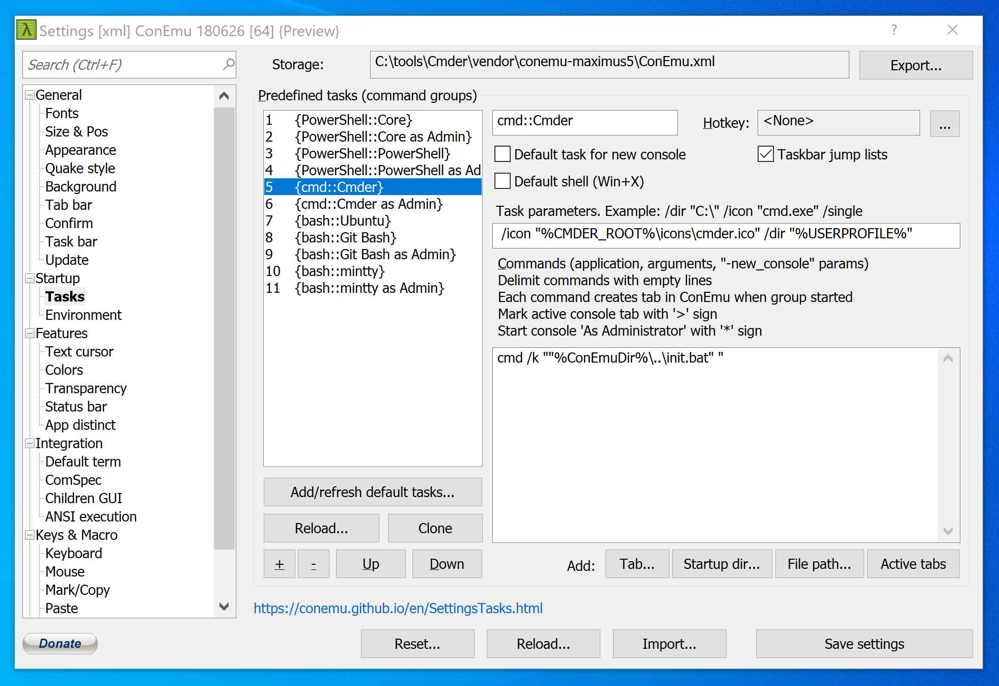

Tasks tell Cmder how to work with different terminals and shells. Here I've listed my tasks for WSL, PowerShell, and more.

<!-- endexcerpt -->

### In This Post

```toc

```

## Intro

These tasks are configured in Cmder's Settings page, under Startup - Tasks.



For example, in the above picture:

-   The "task name" is `cmd::Cmder`
-   The "task parameters" are `/icon "%CMDER_ROOT%\icons\cmder.ico" /dir "%USERPROFILE%"`
-   The "task command" is `cmd /k ""%ConEmuDir%\..\init.bat" "`

### Icons

If you'd like, you can download or create `.ico` files and set them as the icons for your tasks.

Assuming you had `icon.ico` in your user's Pictures folder, you would add the below to a task's parameters:

```{numberLines: false}
/icon "%USERPROFILE%/Pictures/icon.ico"
```

### Admin

To make make a task run with admin privileges, simply prefix the task's command with a `*`. Each of my tasks tend to have an "as Admin" copy that are identical except for the name and that asterisk.

## PowerShell

This is the native PowerShell that comes with Windows; it should work out of the box.

-   Name: `PowerShell::PowerShell`
-   Parameters: `/dir "%USERPROFILE%"`
-   Command:

```
PowerShell -ExecutionPolicy Bypass -NoLogo -NoProfile -NoExit -Command "Invoke-Expression 'Import-Module ''%ConEmuDir%\..\profile.ps1'''"
```

## PowerShell Core

This is Microsoft's newer PowerShell, which is a [manual download and install](https://docs.microsoft.com/en-us/powershell/scripting/install/installing-powershell-core-on-windows?view=powershell-6). You will also need to make sure `pwsh` is on your path for this task to work.

-   Name: `PowerShell::Core`
-   Parameters: `/dir "%USERPROFILE%"`
-   Command:

```
pwsh -ExecutionPolicy Bypass -NoLogo -NoProfile -NoExit -Command "Invoke-Expression 'Import-Module ''%ConEmuDir%\..\profile.ps1'''"
```

## CMD

This is the native Windows command prompt; it should work out of the box.

-   Name: `cmd::Cmder`
-   Parameters: `/dir "%USERPROFILE%"`
-   Command:

```
cmd /k ""%ConEmuDir%\..\init.bat" "
```

## WSL

This is the [Windows Subsystem for Linux](https://docs.microsoft.com/en-us/windows/wsl/install-win10). I use Ubuntu, but my task's command calls `wsl.exe` to run just the default distro.

-   Name: `bash::Ubuntu`
-   Parameters: `/dir "%USERPROFILE%"`
-   Command:

```
set "PATH=%ConEmuBaseDir%\wsl;%PATH%" & wsl.exe
```

<note>

When ConEmu (part of Cmder's package) makes its default task for detected WSL distros, it will use [wslbridge](https://github.com/rprichard/wslbridge). That is not what my setup uses—I use `wsl.exe` directly.

Why not use wslbridge? In my experience, I haven't needed the compatibility layer. I've found that things work a little bit smoother without that extra level in between Cmder and WSL (especially WSL 2).

</note>

## Git Bash

This will call Git's emulated Bash. If you don't use the Git that came with Cmder, you should change the command to point to wherever your Git directory is.

-   Name: `bash::Git Bash`
-   Parameters: `/dir "%USERPROFILE%"`
-   Command:

```
cmd /c ""%ConEmuDir%\..\git-for-windows\bin\bash" --login -i"
```

## Mintty

[Mintty](https://mintty.github.io/) comes with Git and is a different take on a terminal emulator. It is accessible through Cmder, even if its use-case is pretty limited.

-   Name: `bash::mintty`
-   Parameters: `/dir "%USERPROFILE%"`
-   Command:

```
"%ConEmuDir%\..\git-for-windows\usr\bin\mintty.exe" /bin/bash -l
```
