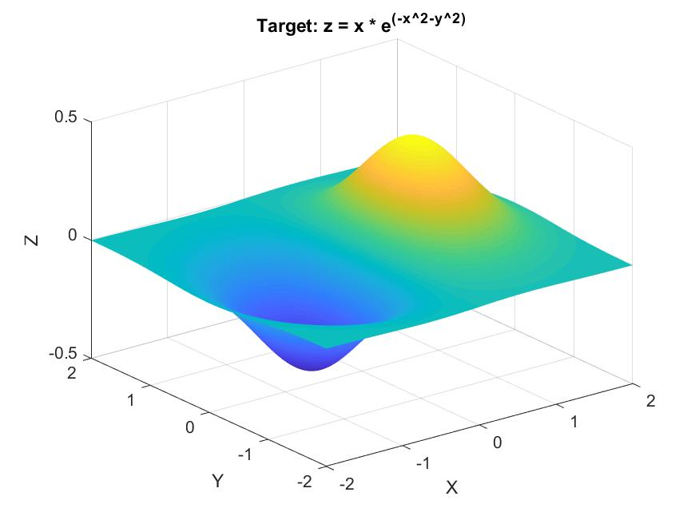
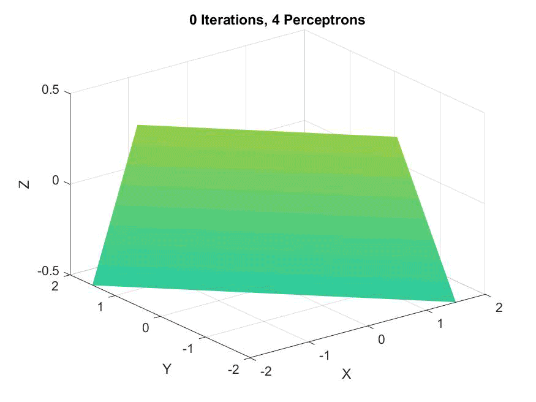

The final project for the Introduction to Brain and Behavioral Computation allowed us to pursue our own interests. My group created an n-dimensional, multi-perceptron neural classification network capable of handling arbitrary data.

My responsibilities on the project centered around building the underlying network, while my group partners worked on scrapping data, documenting the scientific backing, and testing the accuracy of the results. I worked primarily in Java, creating a generic-typed trie-like data structure that allowed us to work with more dimensions of data than we can reasonably visualize. The reasoning for this is complicated but important:

-   For one dimension, either a list or a one-level tree is sufficient
-   For two dimensions, either a grid or a two-level tree is sufficient
-   For three dimensions, either a 3D grid or a three-level tree is sufficient
-   For four or more dimensions, our ability to visualize the result breaks down, but n-level trees maintain the inductive proof

The benefit of my data structure was that not only did it allow each perceptron at the leaves to be completely independent but only be assigned the correct data to analyze, it also could be recursively traversed to produce a summary of the enntire network. This was excellent for debugging, as we could have the network output large piecewise functions which we could graph to get a visual understanding of low-dimension tests.

However, in presenting to the class, I decided to take those visualizations a step further. I created another version of the recursive traversal which, rather than outputting the piecewise functions in mathematical notation, would return them in Matlab code. With this, I created a demo test file that would create a Matlab file as output. When that Matlab file was run, it would graph each function sequentially and save the images, allowing me to create animations demonstrating the behavior of our network classifying points of a simple 3D function.

The target plane the network was being trained to emulate:

An animation of a single perceptron, showing it never converges:

An animation of two perceptrons along the X and Y axes, not converging but showing similarity to he target:

An animation of four perceptrons along the X and Y axes, matching the target to a reasonable degree:

An animation of eight perceptrons along the X and Y axes (for a total of sixty-four), showing they are slow to converge but suprisingly accurate:

This project is certainly one of my most interesting, since it makes use of neuroscience knowledge that isn't common among computer scientists. I'm more than happy to discuss what my group did here; [just drop me a line!](/contact)

[Source code for this project is available upon request.](/contact)
